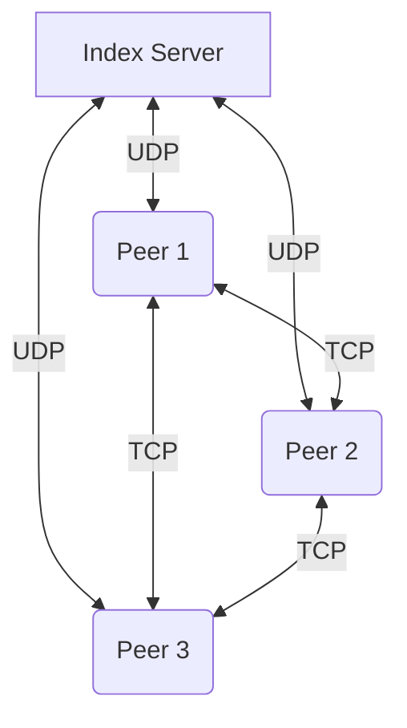
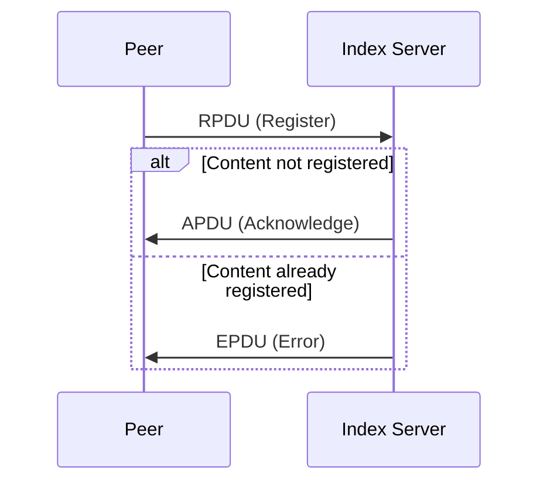
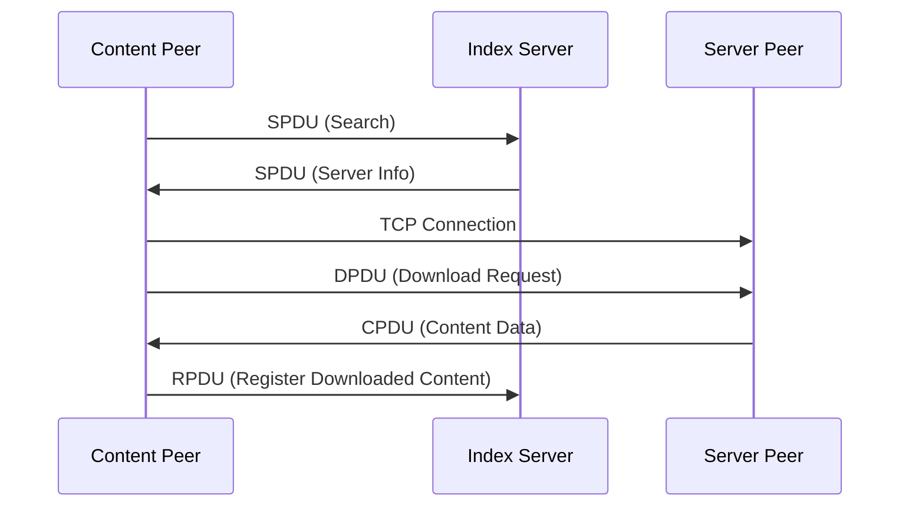
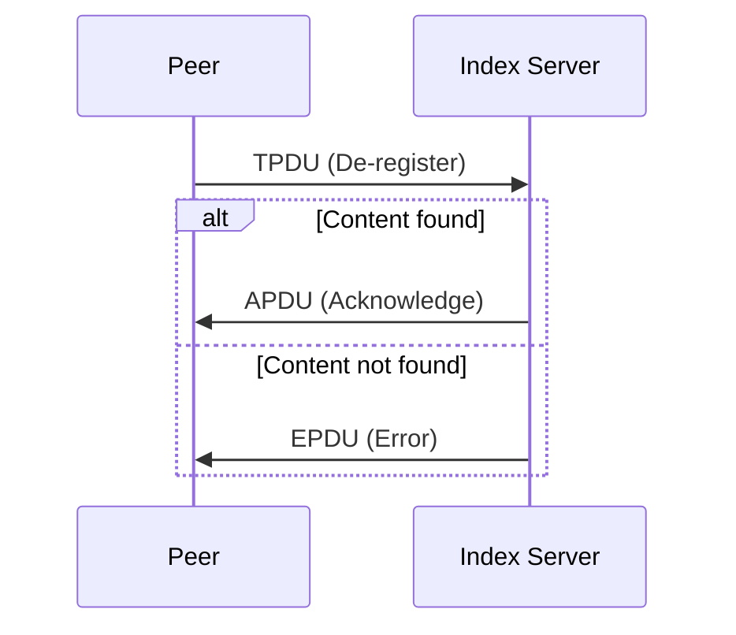

# Peer-to-Peer File Sharing Design Document

## 1. System Overview

This peer-to-peer (P2P) file sharing network allows multiple peers to share and download content from each other. The system consists of two main components:

1. Index Server: Manages content registration and peer discovery.
2. Peers: Act as both content providers and content consumers.

### System Architecture



## 2. Communication Protocols

The system uses two main communication protocols:

1. UDP: For communication between peers and the index server.
2. TCP: For file transfer between peers.

### 2.1 Protocol Data Units (PDUs)

The system uses custom PDUs for communication. Each PDU has a type field (1 byte) and a data field.

| Type | Name | Structure | Description |
|------|------|-----------|-------------|
| R | Registration | Type(R), Peer name, Content name, Address & Port | Sent from peer to index to register content |
| D | Download | Type(D), Content Name | Sent from content client to content server to initiate download |
| S | Search | Type(S), Content name | Used to search for content |
| T | De-Registration | Type(T), Peer name, Content name | Sent from peer to index to remove content |
| C | Content Data | Type(C), Data | Carries actual file data during download |
| O | List of Online Registered content | Type(O) | Request/response for list of all registered content |
| A | Acknowledgment | Type(A) | Positive acknowledgment |
| E | Error | Type(E) | Error message |

## 3. Index Server Design

The index server is implemented in `index.c`.

### 3.1 Data Structures

- `struct pdu`: Represents the basic PDU structure.
- `struct RPDU`: Represents the registration PDU.
- `struct TPDU`: Represents the de-registration PDU.
- `char *data[20][4]`: 2D array to store registered content information.

### 3.2 Key Functions

- `findDContent()`: Finds content in the data array.
- `checkData()`: Checks for existing content.
- `findContent()`: Finds content associated with a specific peer.
- `deGenRpduString()`: Converts string to RPDU structure.
- `deGenTpduString()`: Converts string to TPDU structure.

### 3.3 Main Loop

The server uses a single-threaded approach with a `while(1)` loop to handle incoming requests:

1. Receive UDP packet
2. Process based on PDU type (R, S, O, T, Q)
3. Send appropriate response

## 4. Peer Design

Peers are implemented in `peer.c`.

### 4.1 Data Structures

- `struct pdu`: Represents the basic PDU structure.
- `struct RPDU`: Represents the registration PDU.
- `struct TPDU`: Represents the de-registration PDU.

### 4.2 Key Functions

- `TCPConnection()`: Handles incoming TCP connections for file transfer.
- `terminal()`: Processes user commands and interacts with the index server.
- `genRpduString()`: Converts RPDU to string for transmission.
- `genTpduString()`: Converts TPDU to string for transmission.

### 4.3 Main Loop

The peer uses `select()` to handle both user input and incoming TCP connections concurrently:

```c
while(1) {
    select(FD_SETSIZE, &rfds, NULL, NULL, NULL);
    if(FD_ISSET(TCPs, &rfds)) {
        // Handle incoming TCP connection
    }
    if(FD_ISSET(0, &rfds)) {
        // Handle user input
    }
}
```

## 5. Key Processes

### 5.1 Content Registration



### 5.2 Content Download



### 5.3 Content De-registration



## 6. Error Handling

- The system uses EPDU (Error PDU) to communicate errors between peers and the index server.
- TCP error handling relies on standard socket error checking.
- The index server checks for duplicate content registration and invalid de-registration requests.

## 7. Limitations and Future Improvements

- The current implementation limits the number of registered content to 20.
- There's no authentication mechanism for peers.
- File transfer doesn't include integrity checks or support for large files.
- The system could benefit from a distributed index rather than a centralized one for better scalability.
